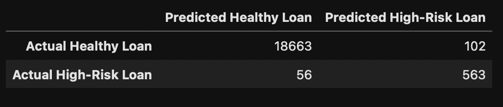
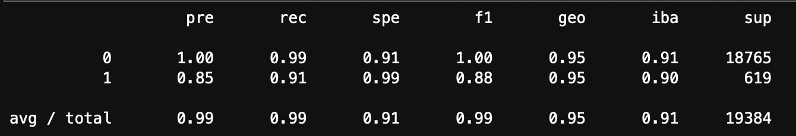
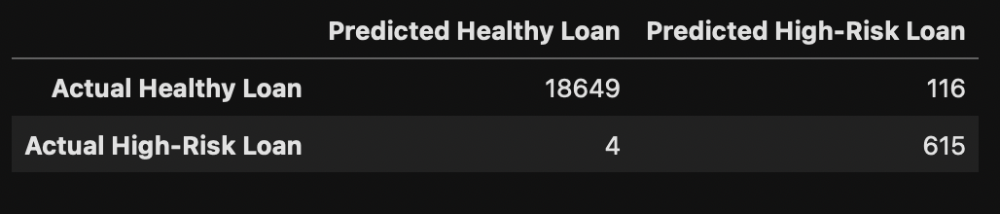
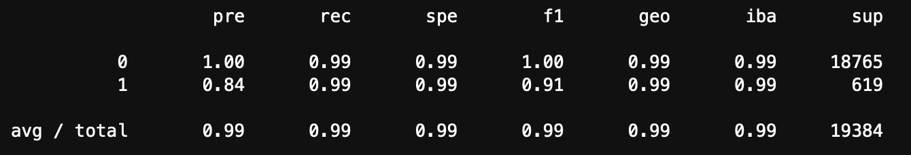

# Module 12 Challenge: Credit Risk Analysis

## Overview of the Analysis
---

Credit risk poses a classification problem that’s inherently imbalanced. The reason is that healthy loans easily outnumber risky loans. This program aims to solve this classification imbalanced data problem by identifying an ideal Logistic Regression Model for this type of credit risk analysis. The program utilizes a dataset of historical lending activity from a peer-to-peer lending services company and performs two Logistic Regression Models of the dataset's original imbalanced data and oversampled data in order to best predict a loan to be healthy or high-risk.

This program initially applies a machine learning `LogisticRegression` model fitted to the original imbalanced data, resulting in an imbalanced classification report. The model was enhanced through resampling methods such as `RandomOverSampler` to produce an oversampled model of the original data.

## Results
---

Balanced accuracy scores and the precision and recall scores of all machine learning models.

* Machine Learning Model 1:
  * Model 1 generated a Balanced Accuracy score of 0.9520479254722232 (95%), with a 100% Precision score and a 99% Recall in predicting healthy loans. However, with the model performing at a Precision score of 85% with a Recall of 91%, it indicates the imbalanced model's noticeable bias towards designating loans as healthy loans `0` rather than high-risk loans `1`.

  * Imbalanced Model Confusion Matrix
  

  * Imbalanced Model Classification Report
  

* Machine Learning Model 2:
  * Model 2 generated a Balanced Accuracy score of 0.9936781215845847 (99%), with a 100% Precision score and a 99% Recall in healthy loan predictions contrasted to a 84% Precision score but 99% Recall in high-risk loan predictions.

  * Oversampled Model Confusion Matrix
  

  * Oversampled Model Classification Report
  
   

## Summary
---
Following analysis of the predictions generated by the two models, I can infer that the `LogisticRegression` produced through the `RandomOverSampler` resampling module demonstrates an effective model for predictions utilizing imbalanced data. The model utilizing imbalanced data without resampling performed noticeably worse (see 'Imbalanced Model Classification Report' & 'Oversampled Model Classification Report'), with its values trending slightly further from 1 (100%) than the oversampled model. 
